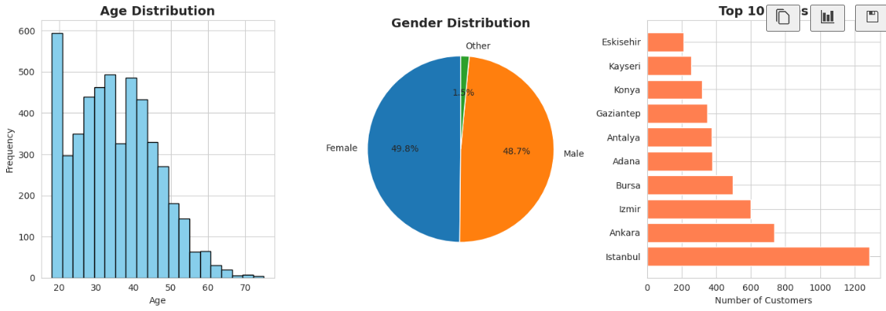

# E-Commerce Customer Behavior EDA 📊

## 📝 Project Overview
This project performs an **Exploratory Data Analysis (EDA)** on a dataset of 5,000 e-commerce transactions. The goal is to uncover patterns in customer behavior, product performance, and satisfaction levels to drive business decisions.

The repository is structured to provide a clean workflow from raw data to visual insights.

## 📂 Repository Structure
```text
ecommerce_EDA/
│
├── data/
│   └── ecommerce_customer_behavior_dataset.csv     # Raw dataset
|   └── ecommerce_cleaned.csv                       # Cleaned dataset
│
├── images/
│   ├── rcustomer_demographics.png                   
│   └── monthly_revenue_and_order.png                 
│
├── EDA.ipynb                                       # Main Analysis Notebook
├── cleaner.ipynb                                   # Python script to clean data
└── README.md
```

## 🔍 Key Findings
Based on the analysis in `EDA.ipynb`, several actionable insights were discovered:
1.  **Product Satisfaction:** 'Books' is the highest-rated category (3.97), while 'Food' has the lowest ratings (3.83).
2.  **Customer Profile:** The average customer is ~35 years old and spends about 14.5 minutes per session.
3.  **Device Usage:** Mobile devices account for a significant portion of transactions (approx. 55%).
4.  **Operational Efficiency:** Delivery time ranges from 1 to 25 days, with a notable correlation to customer satisfaction ratings.
5.  **Retention:** Approximately 60% of the user base consists of returning customers.

## 📸 Visualizations

[Dashboard Overview](https://public.tableau.com/app/profile/franco.nicolay4042/viz/KeyE-commerceKPIsandBehavioralAnalysis/Dashboard1#1)




## 🛠️ Technologies Used
* **Python 3.x**
* **Pandas** & **NumPy** (Data manipulation)
* **Matplotlib** & **Seaborn** (Data visualization)
* **Tableau** (Interactive Dashboard)

## 🚀 Getting Started

### Prerequisites
Make sure you have Python installed. You can install the required libraries using:

```pip install pandas numpy matplotlib seaborn```

### Installation
1. Clone the repository:
```git clone https://github.com/NicolayF/ecommerce_EDA.git```

2. Navigate to the project directory:
``` cd ecommerce_EDA```

3. Run the notebook:
``` jupyter notebook EDA.ipynb```

## 🔮 Future Work
* **Churn Prediction:** Implement a Logistic Regression model using the `Is_Returning_Customer` column.
* **Segmentation:** Apply K-Means clustering to group customers by purchasing behavior.
* **Time Series Analysis:** Forecast future sales trends based on the `Date` column.

## 📜 License
This dataset is released under the CC0: Public Domain license.